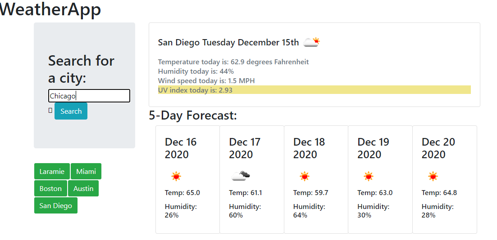

Decription: 
*Weather Search Application - (I have created a search application that calls APIs to display detailed weather forecasts for cities upon search using a combination of HTML, CSS/Bootstrap and dynamic JS/JQuery.  The scheduler contains a current forecast, as well as a five-day forecast. UV ratings color-coded based on risk level. When searches are executed, the cities will be saved in a newly created button and can be toggled back to later.  Searched cities are saved to local storage, and the most recent search will populate upion re-navigating to or refreshing the page.)

*Submission date of 12/15/2020

Screenshots:

Links: 
*GitHub Repository: https://github.com/awoolley1/WeatherApp
*Live URL: https://awoolley1.github.io/WeatherApp/

Author: 
*Alex Woolley; https://github.com/awoolley1; alexander.s.woolley@gmail.com